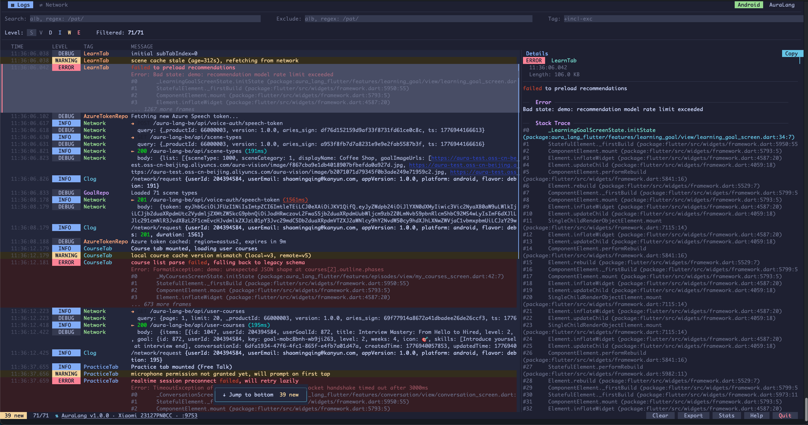
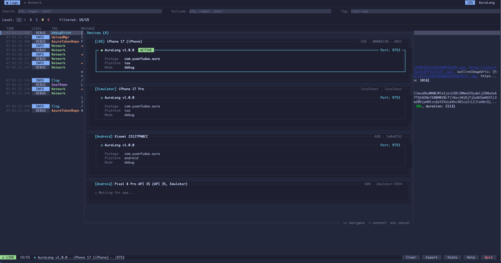
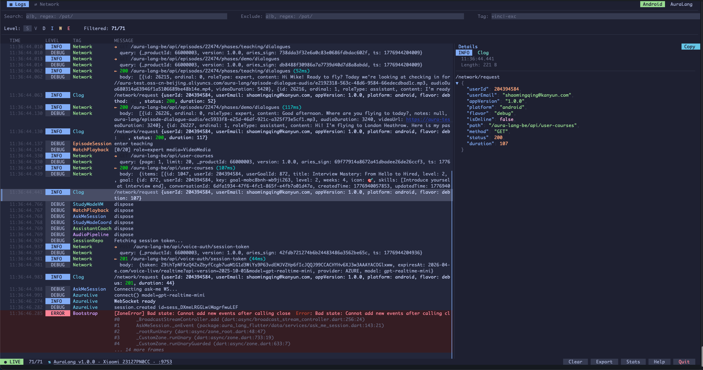
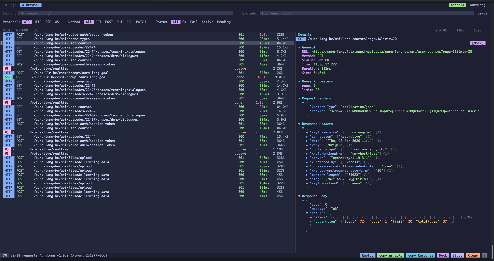
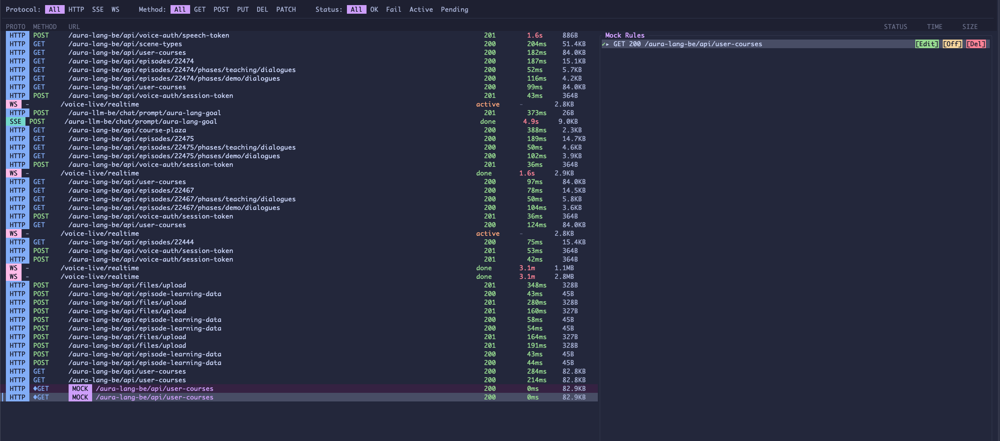
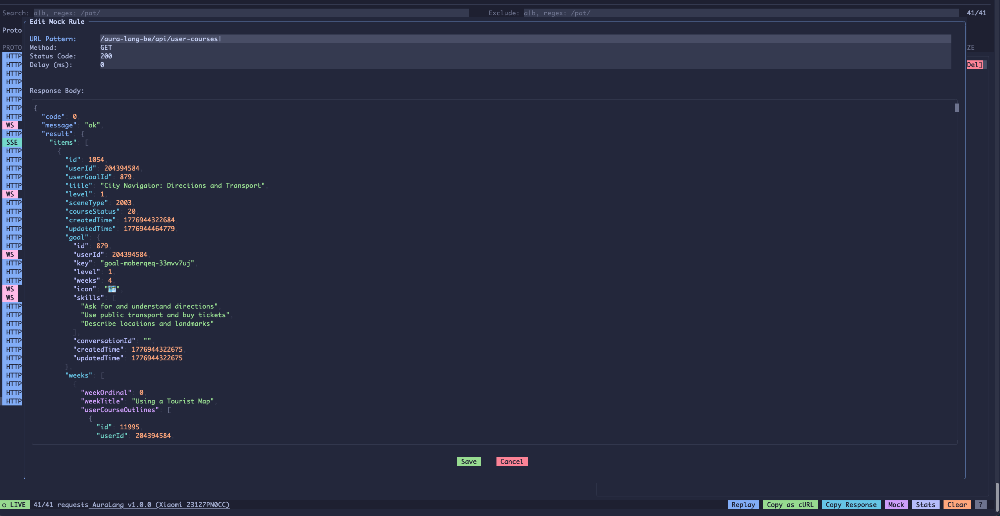
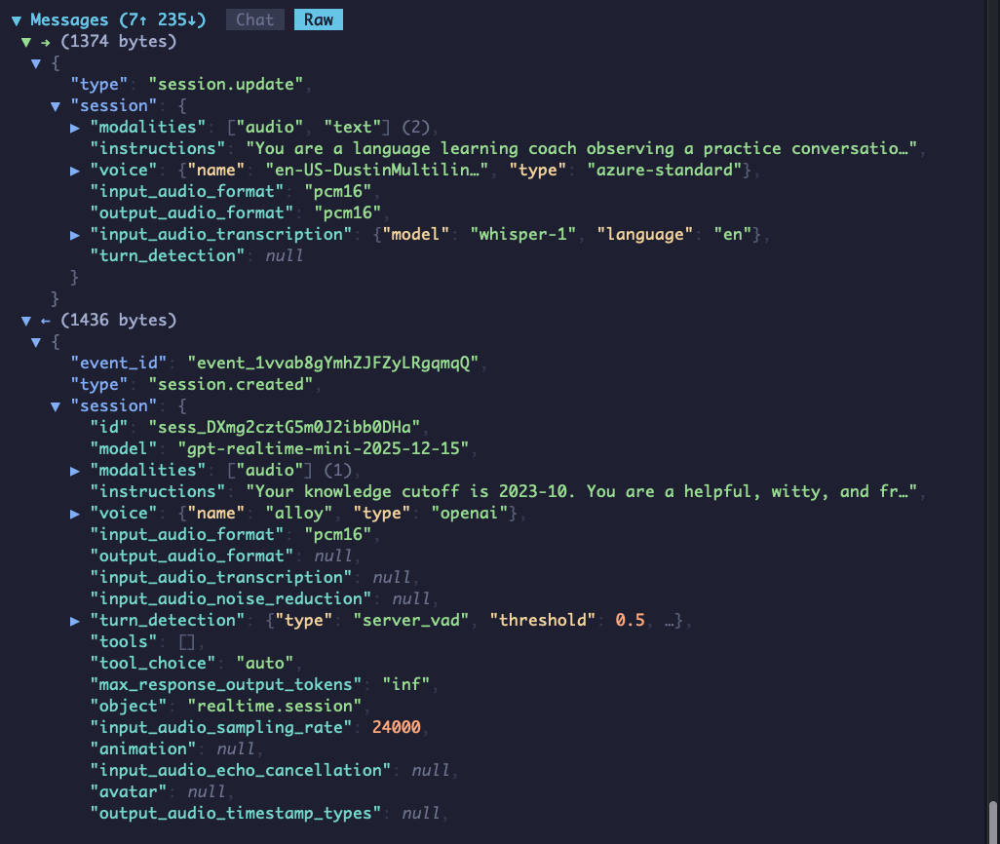
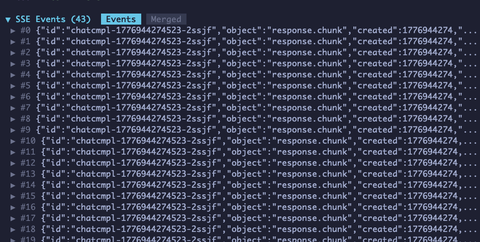
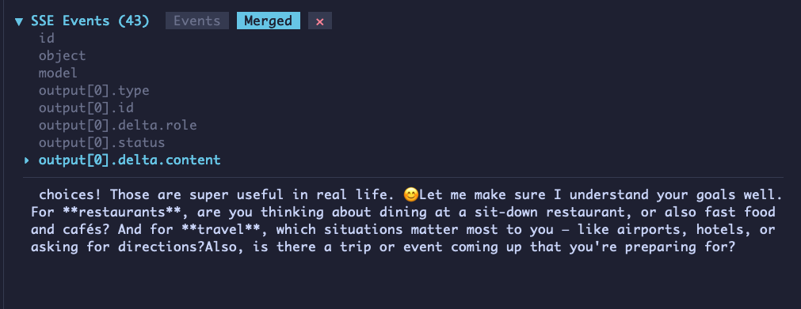
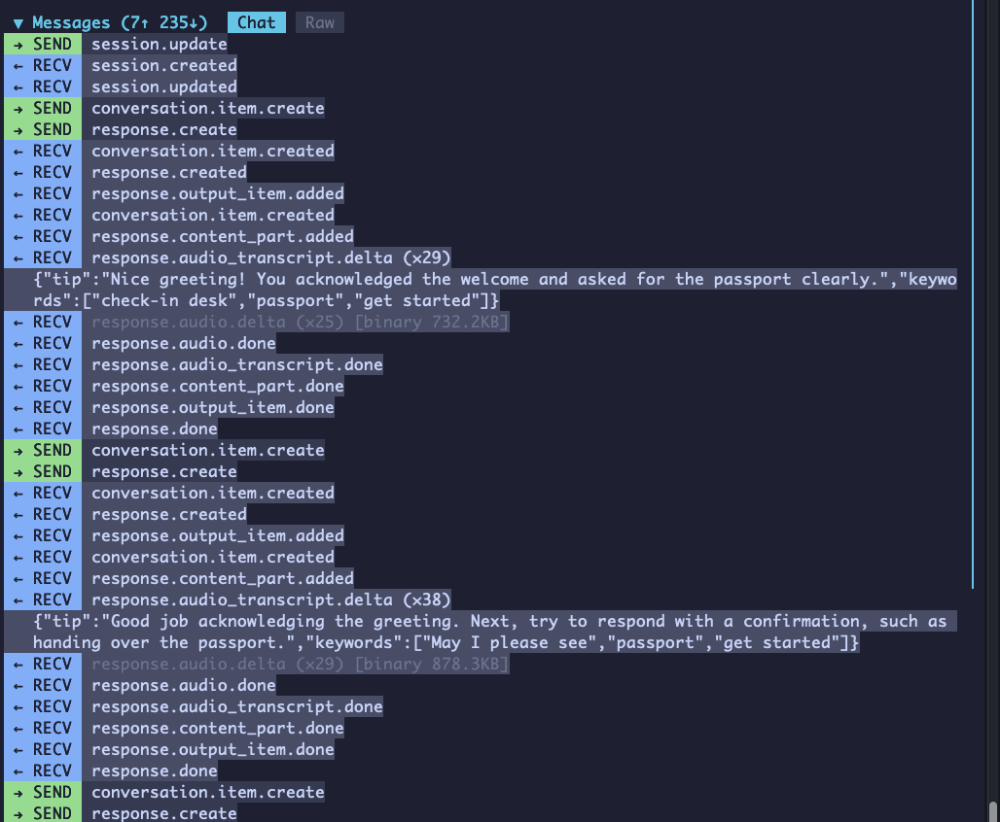

# flog

```
███████╗██╗      ██████╗  ██████╗
██╔════╝██║     ██╔═══██╗██╔════╝
█████╗  ██║     ██║   ██║██║  ███╗
██╔══╝  ██║     ██║   ██║██║   ██║
██║     ███████╗╚██████╔╝╚██████╔╝
╚═╝     ╚══════╝ ╚═════╝  ╚═════╝
```

**给 Flutter 开发者的终端日志查看器 + 网络调试器。**



```bash
curl -fsSL https://raw.githubusercontent.com/shaominngqing/flog/master/install.sh | bash
```

## 解决什么问题

Flutter 开发日志查看和网络调试一直有明显短板：

**日志方面**
- `flutter run` 输出里业务日志和系统日志（`I/flutter`、`W/1.raster`、`D/TrafficStats`）混在一起，没有级别颜色、没法过滤、没有搜索
- JSON 被挤在一行，可读性差
- Android `logcat` 噪音大、过滤繁琐，单条日志 1KB 长度限制会把长 JSON 截断
- iOS 端通过 Xcode / Console 看日志，看不到 Flutter 框架层（`debugPrint`、framework error）的完整系统日志

**网络方面**
- 看请求详情要么加 `print`，要么开 DevTools，每次重启都要重连
- DevTools 网络面板功能有限
- 抓包工具（Charles、Proxyman、Reqable）需设置代理、装证书，调移动端还要处理网络环境
- SSE、WebSocket 等流式请求缺少专门的可视化支持

其他平台都有对应成熟工具（Flipper / Proxyman / Chrome DevTools 等），**Flutter 生态在这一方向长期空缺**。flog 就是为填补这个空缺而生。

## 产品优势

### 零代理、零网络依赖

这是 flog 与通用抓包工具最本质的区别：

- 无需设置 `HTTP_PROXY`、无需装 CA 证书
- 无需设备与电脑在同一网络
- 仅需 USB 连接：Android 走 `adb forward`，iOS 真机走 usbmuxd，模拟器直通
- 自动设备发现：`flutter devices` 能识别的都自动接入

### 缓存不丢

- Dart 端作为唯一数据源，App 启动即开始记录
- `FlogStore` 环形缓冲：10 万条日志 + 1 万条请求
- 不依赖 flog 连接状态：即使 flog 没开，数据也在 Dart 端缓冲
- flog 启动或重连后，Dart 端自动把历史数据回放给 TUI
- 问题发生时即使没连电脑、没开 flog，事后仍可完整回溯，对偶发问题复现至关重要

### 多设备、多 App 自动发现

- 自动识别所有已连接设备及其上接入 flog 的 App
- 底部设备选择器一键切换
- 切换后即时重建历史记录，支持模拟器 + 真机无缝调试



### 终端优先、轻量无负担

选择 TUI 而非 Web 面板：进程开关无心理负担，Rust 实现响应迅速，二进制产物仅几 MB，一键安装一键卸载，不依赖运行时。

TUI 不意味着门槛高：完整支持鼠标操作（点击、滚轮、右键菜单）与键盘快捷键，`?` 一键打开完整快捷键说明。

### Release 零开销

- `flogEnabled` 在 release 模式为 `false`，AOT 编译时移除所有 flog 代码
- 运行时零开销
- 系统日志（`debugPrint` / `FlutterError.onError` / `PlatformDispatcher.onError`）自动捕获，无需手动转发

---

## 功能介绍

### ▤ Logs — 实时日志流



**过滤与搜索**
- 级别过滤：Verbose / Debug / Info / Warning / Error
- Tag 过滤：支持逗号分隔、`-tag` 排除、正则表达式
- 全文搜索：`/` 触发，支持 `/正则/i` 语法，`n/N` 跳转匹配
- 重复日志自动折叠
- 统计视图：级别分布、Tag 排名

**详情面板**
- JSON 自动格式化，语法高亮，按深度着色
- JSON 树可折叠展开至任意层级
- 不仅 JSON，Dart 对象 `toString` 输出也能识别并格式化
- 一键复制、书签标记、日志导出

**其他**
- Jump to Bottom 浮层：暂停滚动后显示新日志计数
- 10 万条环形缓冲，启动后不丢失

---

### ⇄ Network — 网络请求检查器



**协议支持**
- HTTP / SSE / WebSocket 统一列表展示
- 列表字段：Protocol、Method、URL、Status、Duration、Size
- 过滤器行内 pill 切换（Protocol / Method / Status）
- URL 搜索

**请求详情**
- General：URL、Method、Status、Duration、Size
- Query Parameters 自动解析
- Request / Response Headers
- Request / Response Body：JSON 语法高亮 + 可折叠树

**Mock 规则**

从当前请求一键创建 mock 规则，从 TUI 编辑响应体，通过 Direct Socket 下发给 App：



匹配的请求会被 `FlogMockInterceptor` 拦截，返回预设响应，在列表中以 `[Mock]` 标记：



**核心操作**
- **Copy as cURL** — 一键复制为 curl 命令
- **Copy Response** — 一键复制响应体
- **Replay** — 从 TUI 重放请求
- **Mock** — 创建 mock 规则拦截指定请求

**SSE Merged View**

按指定 JSON 字段自动拼接多个 chunk 为完整文本。默认 `Events` 视图展示每个 chunk：



切到 `Merged` 视图（会自动识别 OpenAI / Claude 等 LLM streaming 格式，同一 URL 后续请求自动继承设置）：



**WebSocket Chat View**

对话流视图：send 靠左（绿色 →），recv 靠右（蓝色 ←）。`*.delta` 类消息自动合并拼接，base64 音频数据折叠为 `[binary N KB]`：



可切换到 `Raw` 视图查看原始 JSON 树：



对调试 AI 相关功能（LLM streaming、语音实时会话等）帮助显著，无需借助浏览器 DevTools。

**扩展功能**
- **Performance Stats** — 延迟百分位、Top 5 慢请求、状态码分布、按域名统计
- **Mock 规则管理面板**（`Ctrl+M`）— 统一管理所有 mock 规则

---

## 通信架构

flog 采用 **Direct Socket + Data Source** 架构：

**Dart 端 = 数据源** — `FlogStore` 环形缓冲区（50K 条 FIFO）存储所有日志和网络消息。App 启动后即开始记录，不依赖 flog 是否连接。

**flog TUI = 纯渲染器** — 连接时 Dart 自动回放全部历史数据，之后无缝接收实时消息。断连不丢数据，切换 Session 即时重建。

**系统日志自动捕获** — `Flog.init()` 自动注册 `debugPrint` / `FlutterError.onError` / `PlatformDispatcher.onError` 三个 hook，框架异常、渲染溢出等系统输出自动进入 FlogStore，无需 `flutter logs`。

- 不依赖 VM Service — 日志不再通过 print/developer.log 传输
- 不污染终端输出 — Flutter 控制台里不会有 flog_net 日志
- 自动设备发现 — 通过 `flutter devices` 检测已连接设备
- 全平台支持：
  - **macOS / iOS 模拟器** — localhost 直通
  - **Android** — 自动 `adb forward` 端口转发
  - **iOS 真机** — usbmuxd USB 端口转发

## 用法

```bash
# 启动 flog（默认端口 9753）
flog

# 指定端口
flog --port 9754

# 启动时指定过滤
flog --level w
flog --tag Network
```

## 搭配 flog_dart

flog 能识别任何 Flutter 日志输出。搭配 [flog_dart](https://pub.dev/packages/flog_dart) 可以获得精确的级别和 Tag 解析 + Network Inspector：

```bash
# pubspec.yaml
dependencies:
  flog_dart: ^0.8.0
```

### 初始化

在 App 启动时尽早调用一次 `Flog.init()`，同步执行、零阻塞：

```dart
import 'package:flog_dart/flog_dart.dart';

void main() {
  WidgetsFlutterBinding.ensureInitialized();
  Flog.init();  // 自动注册 hook + 启动 server + 后台获取 app info
  runApp(MyApp());
}
```

### 快速接入 Network Inspector（推荐）

用 `FlogDio` 替换 `Dio`，零配置自动接入 Network Inspector + Mock：

```dart
import 'package:flog_dart/flog_dart.dart';

// 替换 Dio() → FlogDio()，自动注入 HTTP 日志 + Mock 拦截器
final dio = FlogDio(baseUrl: 'https://api.example.com');

// 正常使用，所有请求自动出现在 flog Network 面板
final response = await dio.get('/users');

// SSE 流式请求也内置支持
final sse = await dio.sse('/chat/completions',
  method: 'POST',
  data: {'prompt': 'hello'},
);
await for (final event in sse.stream) {
  print(event);
}
```

> Release 构建自动 tree-shake：`flogEnabled` 在 release 模式为 `false`，所有 flog 代码被 AOT 移除，零开销。

### 日志

```dart
import 'package:flog_dart/flog_dart.dart';

final log = FlogLogger('Network');
log.i('-> GET /api/users');
log.e('Connection failed: $e');
```

### 手动接入 Network Inspector

如果不想用 `FlogDio`，可以手动添加拦截器：

```dart
final dio = Dio();
dio.interceptors.addAll([
  FlogHttpInterceptor(),        // ← 必须放在最前面
  ApiResponseInterceptor(),     // 业务逻辑拦截器
  LoggingInterceptor(),
]);
```

> **注意：** `FlogHttpInterceptor` 必须添加在其他会修改或拦截响应的 interceptor **之前**。如果放在后面，当其他 interceptor 调用 `handler.reject()` 时，flog 看不到原始响应，请求会一直显示为 Pending 状态。

### SSE 流式请求

```dart
await for (final data in FlogSseParser.wrap(
  response.data!.stream,
  url: '/api/chat/completions',
  method: 'POST',
)) {
  final json = jsonDecode(data);
  // ...
}
```

### WebSocket

```dart
final ws = await FlogWebSocket.connect('wss://example.com/ws');
ws.send(jsonEncode({'type': 'hello'}));
ws.stream.listen((data) => print(data));
await ws.close();
```

## 快捷键

按 `?` 可在 flog 内查看完整帮助。

### Logs

| 按键 | 功能 |
|------|------|
| `1` / `2` | 切换 Logs / Network 标签页 |
| `/` | 聚焦搜索框（支持 `a|b`、`/正则/`、`/正则/i`） |
| `\` | 聚焦排除框 |
| `t` | 聚焦 Tag 过滤（如 `+network|-flog_net`） |
| `n` / `N` | 下一个/上一个匹配 |
| `j/k` 或方向键 | 移动选择 |
| `PgUp` / `PgDn` | 翻页 |
| `Home` / `End` | 顶部 / 底部 |
| `G` | 跳回底部（恢复 LIVE） |
| `Enter` | 打开/关闭详情面板 |
| 右键 | 书签切换 |
| `c` | 复制选中日志 |
| `e` | 导出过滤后的日志到文件 |
| `S` | 统计视图 |
| `s` | 选择模式（终端文字选择） |
| 点击底栏 `⇅ AppName …` | 打开设备选择器切换 App |
| `?` | 帮助 |
| `Esc` | 清除过滤 / 关闭浮层 |
| `q` | 退出 |

### Network

| 按键 | 功能 |
|------|------|
| `/` | URL 搜索 |
| `\` | 排除搜索 |
| `c` | Copy as cURL（仅 HTTP） |
| `y` | Copy Response（SSE Merged / WS Chat 模式下复制拼接文本） |
| `r` | Replay 重放请求（仅 HTTP） |
| `M` | 从当前请求创建 Mock 规则（仅 HTTP） |
| `Ctrl+M` | 打开 Mock 规则管理面板 |
| `S` | 统计面板 |
| `E` / `C` | 展开 / 折叠全部 JSON |
| `Enter` | 打开/关闭详情面板 |
| `j/k` | SSE Merged 模式下切换字段；其他情况移动选择 |
| `G` / `End` | 跳回请求列表底部 |
| `Esc` | SSE Merged 模式下退出；其他情况清除过滤 |
| `s` | 选择模式 |

## 安装

```bash
# 一键安装
curl -fsSL https://raw.githubusercontent.com/shaominngqing/flog/master/install.sh | bash

# 或通过 Cargo
cargo install --path .
```

支持 macOS (Intel / Apple Silicon)、Linux (x86_64 / aarch64)、Windows。

### 维护命令

```bash
flog update      # 从最新 GitHub Release 更新 flog，替换前会确认
flog uninstall   # 删除 flog 二进制和本地配置，用户导出的 flog_*.log 不会删除
flog doctor      # 检查更新网络、adb、usbmuxd 和 9753..9762 端口状态
flog devices     # 列出发现的设备和 flog_dart App
```

这些命令不进入 TUI，适合安装维护和排障。`doctor` 会尝试区分端口是
`free`、`flog_dart <app>`，还是 `open, not flog_dart`；`devices` 会短扫
设备和 App，发现可连接的 `flog_dart` 后尽快返回。

## 贡献者文档

- [`docs/ARCHITECTURE.md`](docs/ARCHITECTURE.md) — 分层架构总览。
- [`docs/MODULES.md`](docs/MODULES.md) — 各模块索引。
- [`docs/PROTOCOL.md`](docs/PROTOCOL.md) — flog ↔ flog_dart 线协议规范。
- [`docs/CONTRIBUTING.md`](docs/CONTRIBUTING.md) — 审计分类 / 测试规约 / commit 约定。

当前版本 **0.6.0** —— 新增 `flog update` / `flog uninstall` / `flog doctor` /
`flog devices` 基础维护命令，并保留 Phase 3-4 清理后的分层架构。完整审计线索见
`docs/superpowers/`。

## License

MIT

---

[English](README_EN.md)
