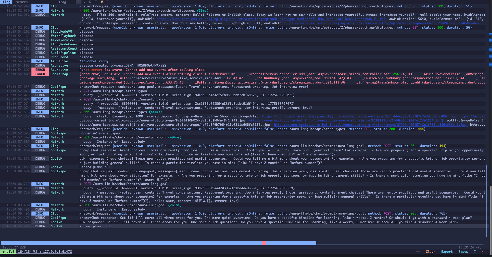
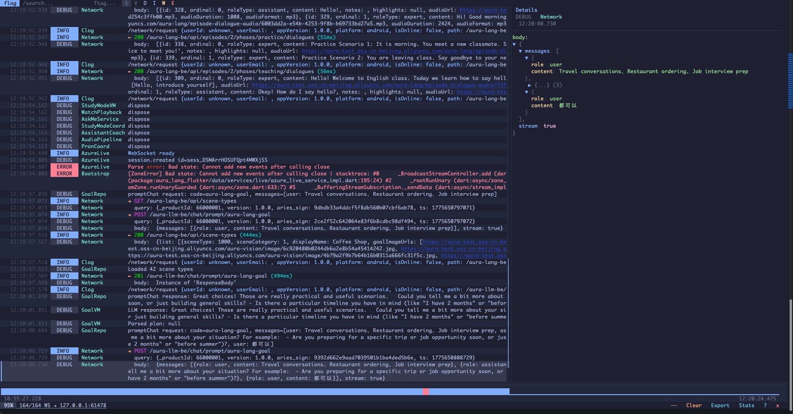

# flog

```
███████╗██╗      ██████╗  ██████╗
██╔════╝██║     ██╔═══██╗██╔════╝
█████╗  ██║     ██║   ██║██║  ███╗
██╔══╝  ██║     ██║   ██║██║   ██║
██║     ███████╗╚██████╔╝╚██████╔╝
╚═╝     ╚══════╝ ╚═════╝  ╚═════╝
```

**给 Flutter 开发者的终端日志查看器。**





```bash
curl -fsSL https://raw.githubusercontent.com/shaominngqing/flog/master/install.sh | bash
```

## 解决什么问题

Flutter 开发中看日志有两个烦的点：

**终端日志不可读** — `flutter run` 的输出里业务日志和系统日志混在一起，没有级别区分、没有颜色、没法过滤、JSON 挤成一行。要在一堆 `I/flutter`、`W/1.raster`、`D/TrafficStats` 里找到你关心的信息，全靠眼睛扫。

**DevTools 日志页每次要重开** — 每次 `flutter run` 重启后 VM Service 地址都变了，DevTools 页面得重新打开、重新连接。开发过程中频繁 hot restart 或重启应用时，来回切换很打断节奏。

## flog 做了什么

flog 是一个独立运行的终端日志查看器。你把它开在一个终端窗口里，它自动连接你运行中的 Flutter 应用，实时显示结构化的日志。

**日志可读** — 级别颜色区分，Tag 对齐，系统噪音过滤掉，只显示你的业务日志。

**不用重新打开** — flog 常驻运行，`flutter run` 重启后自动重连，不需要手动操作。

## 数据源

- **VM Service** — 通过 WebSocket 连接 Flutter VM，自动发现运行中的实例，通过 DDS 代理连接不影响 `flutter run`
- **ADB** — 通过 `adb logcat` 读取 Android 设备/模拟器日志，自动过滤 Flutter 相关 tag
- **stdin** — 管道模式，支持 `flutter run 2>&1 | flog --stdin`

## 功能

- 按级别过滤（Verbose / Debug / Info / Warning / Error）
- 按 Tag 过滤（支持包含/排除，支持正则）
- 全文搜索（支持正则，高亮匹配，`n/N` 跳转）
- 详情面板（JSON 自动格式化、语法高亮、展开/折叠）
- 书签（右键标记，方便回看）
- 日志导出（导出过滤后的结果到文件）
- 统计视图（日志级别分布、Tag 排名）
- 时间线热力图（日志密度分布）
- 重复日志折叠
- 鼠标 + 键盘操作
- 会话持久化（过滤器、书签跨会话保存）
- 10 万条日志环形缓冲

## 用法

```bash
# 自动发现模式（推荐）— 先开 flog，再 flutter run
flog

# ADB 模式
flog --adb
flog --adb -s emulator-5554

# 指定 VM Service 地址
flog --uri ws://127.0.0.1:8181/TOKEN=/ws

# 管道模式
flutter run 2>&1 | flog --stdin

# 启动时指定过滤
flog --level w
flog --tag Network
```

## 搭配 flog_logger

flog 能识别任何 Flutter 日志输出，但搭配 [flog_logger](https://pub.dev/packages/flog_logger) 可以获得精确的级别和 Tag 解析：

```dart
final log = FlogLogger('Network');
log.i('-> GET /api/users');
log.e('Connection failed: $e');
```

没有 flog_logger 也能用，flog 会自动识别 Flutter 标准输出格式。

### Network Inspector

搭配 `FlogHttpInterceptor` 可以在 flog 的 Network 标签页查看 HTTP/SSE 请求详情：

```dart
final dio = Dio();
dio.interceptors.addAll([
  FlogHttpInterceptor(),        // ← 必须放在最前面
  ApiResponseInterceptor(),     // 业务逻辑拦截器
  LoggingInterceptor(),
]);
```

> **注意：** `FlogHttpInterceptor` 必须添加在其他会修改或拦截响应的 interceptor **之前**。如果放在后面，当其他 interceptor 调用 `handler.reject()` 时，flog 看不到原始响应，请求会一直显示为 Pending 状态。

SSE 流式请求使用 `FlogSseParser`：

```dart
await for (final data in FlogSseParser.wrap(
  response.data!.stream,
  url: '/api/chat/completions',
  method: 'POST',
)) {
  final json = jsonDecode(data);
  // ...
}
```

## 快捷键

| 按键 | 功能 |
|------|------|
| `/` | 搜索（支持 `/正则/i`） |
| `n` / `N` | 下一个/上一个匹配 |
| `j/k` 或方向键 | 滚动 |
| `Enter` | 详情面板 |
| 双击 | 打开详情 |
| 右键 | 书签 |
| `e` | 导出 |
| `S` | 统计 |
| `?` | 帮助 |
| `Esc` | 清除过滤 |
| `q` | 退出 |

## 安装

```bash
# 一键安装
curl -fsSL https://raw.githubusercontent.com/shaominngqing/flog/master/install.sh | bash

# 或通过 Cargo
cargo install flog
```

支持 macOS (Intel / Apple Silicon)、Linux (x86_64 / aarch64)、Windows。

## License

MIT

---

[English](README_EN.md)
