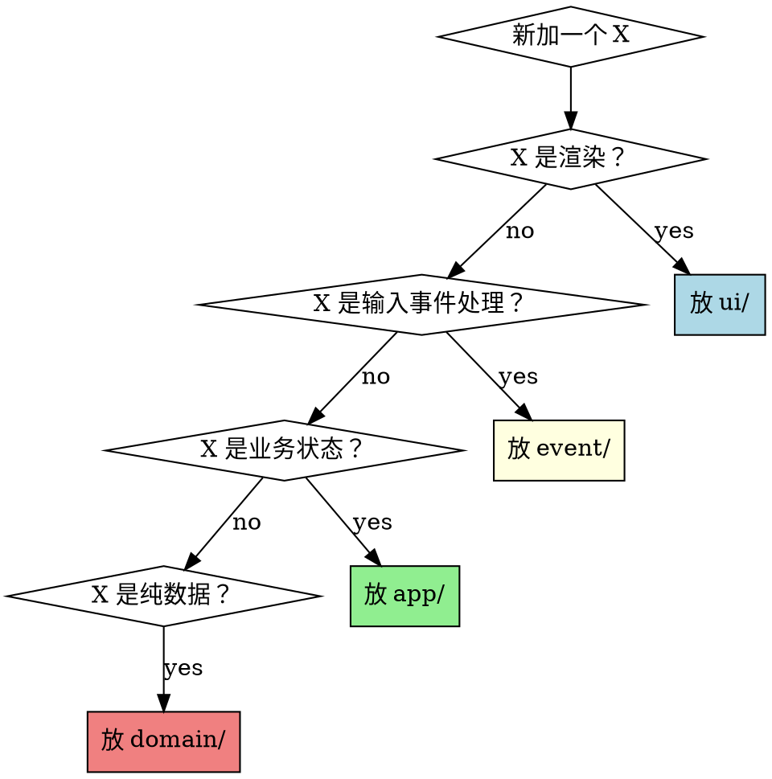

# UI 框架边界与 GUI 迁移路线

本文档的目的是**锁住**代码库对 ratatui / crossterm 的依赖范围，让未来
要加 GUI（或把 TUI 换成别的终端 UI 框架）时不需要大动干戈。

本文档的规则必须被 CLAUDE.md 顶部引用，让 AI 每次启动都看到边界。

---

## 1. 分层图与 UI 依赖权

```
┌─────────────────────────────────────────────────────────────────┐
│  ui/ (ratatui renderers)        gui/ (future, egui/iced/tauri)  │  ← Framework-bound view layer
│  只读 App / 只写 LayoutCache     只读 App / 只写 LayoutCache      │    MAY import ratatui / egui / ...
└───────────────┬─────────────────┬───────────────────────────────┘
                │                 │
                │    reads App    │
                ▼                 ▼
┌─────────────────────────────────────────────────────────────────┐
│  app/        ← 状态机、LayoutCache、业务动作                       │  ← UI-agnostic core
│  event/      ← 输入归一化（ClickRegion, KeyAction）               │    MAY import exactly ONE
│  domain/     ← 纯数据 + 过滤 + mock 规则                          │    adapter framework
│  parser/     ← 日志/网络解析                                       │    (currently: crossterm)
│  input/      ← WebSocket 协议                                     │    NEVER import any renderer
│  transport/  ← 设备发现 + 端口转发                                 │    framework
└─────────────────────────────────────────────────────────────────┘
```

## 2. 硬规则

### R1 — `domain/` `parser/` `input/` `transport/` `app/` 是 UI-agnostic 的

这五个模块下的任何文件**禁止**：

```rust
use ratatui::...;
use crossterm::...;
use egui::...;
use iced::...;
use tauri::...;
```

——以及任何未来加进来的 UI 框架。

**例外：** 目前无例外。如果未来需要开例外，必须：
1. 在本文件里新增一行规则
2. 在对应文件头的 `//!` 里解释
3. 在 audit 里开一条 D 类条目说明借用意图

### R2 — `event/` 是 input-adapter 层

`event/` 允许依赖**一个** input framework（当前是 `crossterm`）。
但所有从 framework 进来的信号在**走出 `event/`** 之前必须被翻译成本项目
的中性枚举：

| framework 类型 | 项目中性类型 | 位置 |
|---|---|---|
| `crossterm::MouseEvent` | `ClickRegion` + `ClickClass` | `event/click_region.rs` |
| `crossterm::KeyEvent` | （未来）`KeyAction` | `event/keys.rs` 里应抽出 `KeyAction` |
| `crossterm::MouseEventKind::ScrollUp/Down` | `ScrollDir` | 已抽 |

**目前未完成的部分：** `KeyCode` 直接被 `apply::apply_*` 读 —— 见
§6 "已知偏离"。

### R3 — `ui/` 可以自由依赖 ratatui

`ui/` 下的所有文件可以 `use ratatui::*` 和 `use crossterm::event::*`。

**但是：** `ui/` 函数签名**只能**：
- 读 `&App` / `&mut App`
- 写 `app.layout`（LayoutCache）
- 返回 `()` 或 ratatui 原生类型

`ui/` 函数**不得**：
- 修改 `App` 的业务字段（非 LayoutCache 字段）
- 触发业务动作（那是 `event/apply.rs` 的事）
- 依赖 `domain/` 之外的任何"side effects"

### R4 — `app/` 的公共 API 必须 UI-agnostic

`App` 上任何 `pub` / `pub(crate)` 方法签名**禁止**出现 UI framework 类型。
这条是 R1 的加强版 —— 即使实现里没 `use ratatui`，签名里出现
`ratatui::Color` 也不允许。

**具体检查：**

```rust
// ✅ 允许
pub fn switch_to_app(&mut self, id: &str) { ... }
pub fn toggle_mock_rule(&mut self, idx: usize) -> bool { ... }

// ❌ 禁止
pub fn render_log_entry(&self, f: &mut Frame, rect: Rect) { ... }
pub fn set_highlight_color(&mut self, c: ratatui::style::Color) { ... }
```

### R5 — LayoutCache 只存裸几何

`src/app/layout_cache.rs` 里的字段类型**限于**：

- `u16` / `usize`（terminal cell 坐标或 pixel 坐标均可）
- `(u16, u16)` / `(usize, usize)`（rect 或范围）
- `Vec<(u16, u16)>` / `Vec<usize>`
- `Option<std::time::Instant>` / 原始时间类型
- `bool`
- 项目自己定义的 POD struct（必须 UI-agnostic）

**禁止** `Rect`、`Color`、`Style`、`Frame`、`Span`、`Line` 等任何
framework 类型进 LayoutCache。

**原因：** 未来 GUI 迁移时，terminal cell 会被替换为 pixel，但**数据结构
不变**。如果 LayoutCache 里混入 `Rect`，GUI 要么翻译要么放弃复用。

## 3. 新加功能时的判定树



"业务状态"和"纯数据"的区别：

- **业务状态**：需要跨 UI 交互持久化 / 影响用户能看到什么（active tab、
  mock 规则开关、filter 配置）→ `app/`
- **纯数据**：外部流入的数据流（日志条目、网络请求）→ `domain/`

## 4. 未来 GUI 迁移路线图

如果哪天决定加 egui / iced / tauri GUI，路线是：

### 阶段 1 — 适配层抽象（不破坏当前 TUI）

1. 在 `event/` 下新增 `key_action.rs`，定义中性 `KeyAction` 枚举。
   现有 `handle_input_key` 等改成 `detect_key_action(KeyEvent) -> KeyAction`
   + `apply_key_action(app, action)` 两阶段。
2. 从 CLI / config 决定渲染后端（feature flag `--features tui` / `--features gui`）。
3. 把 `src/ui/` 下所有 ratatui 依赖收拢到 `draw_*` 函数入口。

### 阶段 2 — 新增 `gui/` 模块

1. `src/gui/` 与 `src/ui/` 并列。只依赖 `app::App`、`domain::*`。
2. `gui::draw_logs(ctx, &mut app, rect)` 用 egui 绘制同一数据源。
3. `run/render_loop.rs` 有 `tui_loop` 和 `gui_loop` 两个入口。
4. `main.rs` 按 feature 选择。

### 阶段 3 — LayoutCache 语义扩展

1. 把 LayoutCache 的坐标类型从 `u16` 拓宽到 `i32` 或 `f32`（pixel）。
   如果数字类型必须保持 `u16`（向后兼容 TUI），把 GUI 侧的 LayoutCache
   换成 `GuiLayoutCache` 并列。
2. `ClickRegion` 大概率不用改 —— 它已经是语义级的。

### 阶段 4 — 测试基础设施

1. 特征化测试基线以 App 状态为准，不应依赖 TestBackend。如果依赖，
   迁移到 pure App 断言。
2. GUI 端的快照测试 / Golden image 单独建一套。

### 不需要改的地方（在规则得到遵守的前提下）

- `domain/` —— 0 处
- `parser/` —— 0 处
- `input/` —— 0 处
- `transport/` —— 0 处
- `app/` —— 0 处（可能新增方法，但现有不改）
- `event/click_region.rs` / `detect.rs` / `apply.rs` —— 0 处
- 特征化测试 —— 0 处（它们测的是 App 行为，不是渲染）

**这是迁移成本的上限。** 如果真要做，大约是 1-2 周的工作量（按单人
全职算），而不是重写。

## 5. 校验清单（code review 时用）

拿到 PR 打开 `src/`：

- [ ] `grep -rn "use ratatui" src/domain/ src/parser/ src/input/ src/transport/ src/app/` —— 应为空
- [ ] `grep -rn "use crossterm" src/domain/ src/parser/ src/input/ src/transport/ src/app/` —— 应为空
- [ ] 新加 pub 方法在 `app/` 下 —— 签名里没有 UI framework 类型
- [ ] 新加字段在 `LayoutCache` 下 —— 类型是 R5 列的裸类型
- [ ] 新加 `ui/` 函数签名是 `(f: &mut Frame, app: ..., area: Rect)` 形状
- [ ] 新加事件处理 —— 走 ClickRegion / KeyAction 两阶段，不直接读 crossterm 类型做 mutation

## 6. 已知偏离

### D-1：`event/keys.rs` 直接读 `KeyCode` 做 mutation

**现状：** `handle_normal_key(app: &mut App, key: KeyEvent)` 里直接
`match key.code { KeyCode::Char('j') => app.select_down() }`，
没有走 `KeyAction` 中性枚举。

**原因：** Phase 3 Step 3.6 时决定只抽出鼠标的 ClickRegion；键盘派发
在 107 条特征化测试保护下认为短期内不会换框架，留到下次再说。

**迁移时要做：** 按 §4 阶段 1 第 1 步抽出 `KeyAction`。大约 300-400 行
改动。

### D-2：`render_loop` 是 30Hz pull，非事件驱动

**现状：** `run/render_loop.rs` 用 `tokio::time::interval(33ms)` 定时重绘。
GUI 框架通常是 push model（状态变 → 标记 dirty → 事件循环重绘）。

**原因：** TUI 屏幕抖动不可见，30Hz pull 简单且不丢事件。

**迁移时要做：** GUI 侧新写一个 event-driven loop，在 `app/mode.rs` 等
mutation 点加 `app.mark_dirty()`，renderer 只在 dirty 时重绘。

### D-3：渲染器是 scroll 权威

**现状：** `scroll_offset` 的 clamping 在渲染函数里（CLAUDE.md 原话
"renderer is the scroll authority"）。

**原因：** TUI 的列表视口大小每帧可能变（终端 resize），在渲染时夹紧
最自然。

**迁移时要做：** GUI 里 ViewModel 通常维护 offset。可能需要把 clamping
逻辑抽到 `app/scroll.rs::clamp_offset(offset, content_len, viewport_h)`
纯函数，TUI 和 GUI 都调用。

## 7. CI 硬墙（可选实现）

本项目目前**不强制** CI 检查 R1/R2。如果未来想加，推荐脚本：

```bash
#!/bin/bash
# scripts/check-layer-boundaries.sh
set -e

FORBIDDEN="use ratatui|use crossterm|use egui|use iced|use tauri"
SCOPED_DIRS="src/domain src/parser src/input src/transport src/app"

if grep -rnE "$FORBIDDEN" $SCOPED_DIRS 2>/dev/null; then
    echo "❌ UI framework import leaked into UI-agnostic layer"
    echo "   See docs/UI_FRAMEWORK_BOUNDARY.md §2 R1"
    exit 1
fi
echo "✅ Layer boundaries clean"
```

GitHub Actions 工作流里跑这个，作为 PR 的 required check。

---

**最后一条最重要的话：** 这份文档如果没被执行，写得再漂亮也没用。
请在每次重构、每次 PR review 时**对照 §5 的 checklist**。几分钟的
机械审查能避免数小时的迁移债。
